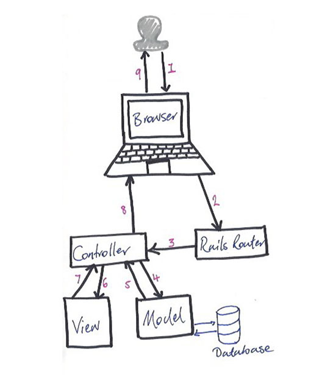

# Instagram clone

## Ruby version
* ruby version 2.5.1

## Configuration
clone repo and follow the instructions to create the required database

## Database creation
```
Using the built in sqlite3

```

## Added Gems
```
gem 'bootstrap-sass', '~> 3.3.6'
gem 'autoprefixer-rails', '~> 6.3.7'
gem 'devise', '~> 4.2'
gem 'capybara', '~> 2.7', '>= 2.7.1' (add this to group test)
gem 'rspec-rails', '~> 3.4', '>= 3.4.2' (add to BOTH group and test development)
gem 'guard', '~> 2.14.0' (add to group development)
gem 'guard-rspec', '~> 4.7.2' (add to group development)

```

## Required installations for gem dependencies
```
bundle install

```
## Starting the server
```
bin/rails server # Start the server at localhost:3000

```

## The Request/Response Cycle for a Rails app

